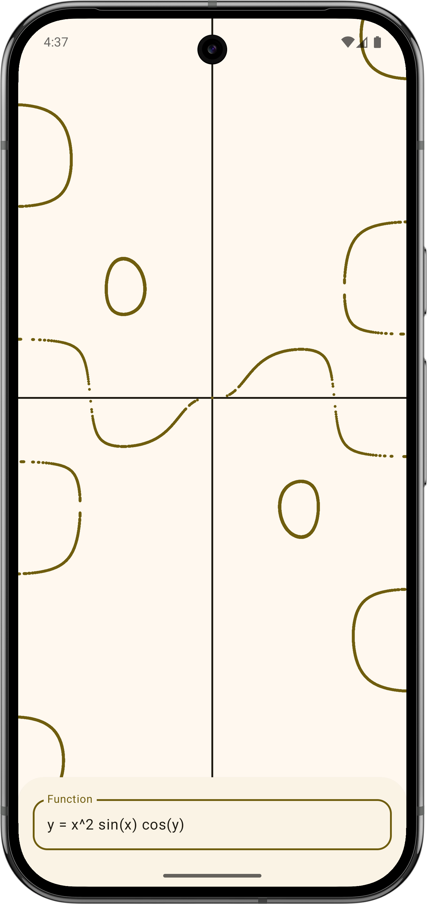
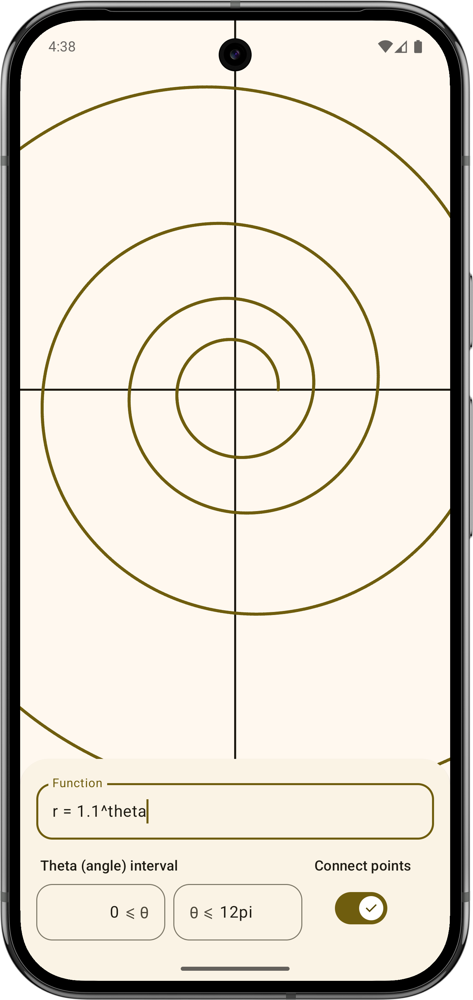
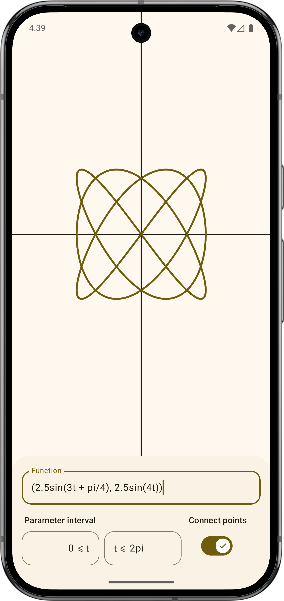

# SimplyGraph

A simple, fast graphing calculator for Android

Follows the latest Material 3 design guidelines and adapts to the system color (Material You)

Supports explicit and implicit functions and relations, polar functions, and parametric relations

## Screenshots

## How it works

This app utilises JNI to offload the graph point calculation to native C++ for extremely fast
calculation of points (at least a few orders of magnitude improvement over Kotlin code in my own
benchmarks). The basic layout of how it works is:

- (Steps)

1. Function string input by user
2. JNI function called: Function string, canvas geometry data, scale and offset are passed
3. JNI performs C++ function call passing all the data
4. C++ function returns std::vector<float> containing point data
5. JNI returns array of floats
6. Points are plotted on Jetpack Compose Canvas

The exact working is slightly more complex, for example the C++ point calculation function analyses
the function string to determine whether it is explicit, implicit, polar or parametric and performs
the calculations accordingly, and also simplifies the graph if there are too many points to save
memory and drawing time.

### Special thanks

- This app uses [ExprTk](https://github.com/ArashPartow/exprtk) to evaluate mathematical
  expressions. Thanks to Arash Partow for creating this library.